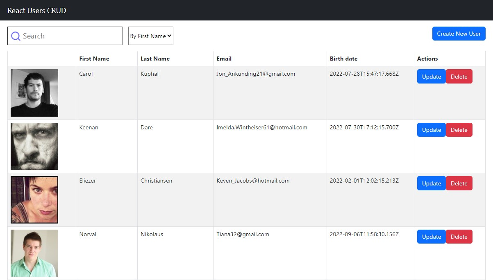
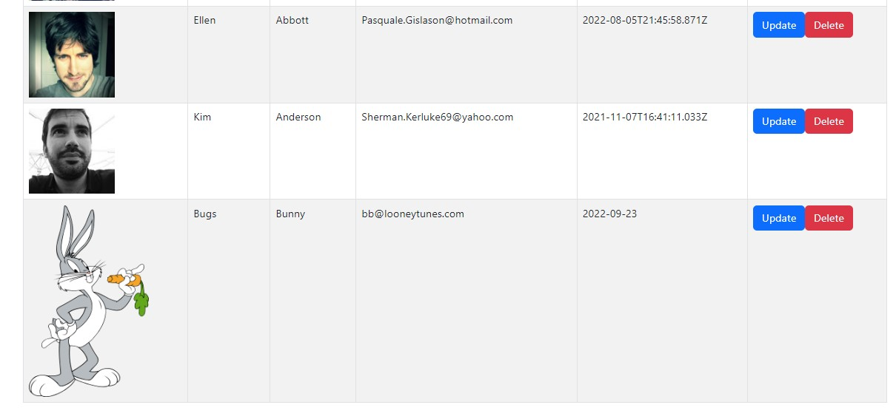

## Crud Users

> Live Link:
https://w1fr7p-3000.preview.csb.app/

### Steps

### 1-List of Components

- Container / App
  - Searchbox
  - List
    - List of users
    - Loading animation, data not fount feature
  * Createuser modal

### 2- Create Components State Data

---

> What I practiced?

- Passing data to components
- Fetch api calls
- Condtional rendering
- Debugging
- Hooks, useState, useEffect
- Loading feature
- Arrow functions
- Rendering list data with map
- Filtering data
- Filter by name, surname
- setState callbacks
- Stateless functional components
- Project structure
- Update and delete functionality for components
- Before remove user, modal opens and asking for confirmation

## Tasks to do

- Pagination

## What I learnt

- It is better to keep input states its own component.
- Important; setting the state is asynchronous, we need to define a callback function for changing the state at the same time. For the hooks "useState".

## Image

This project was bootstrapped with [Create React App](https://github.com/facebook/create-react-app).
