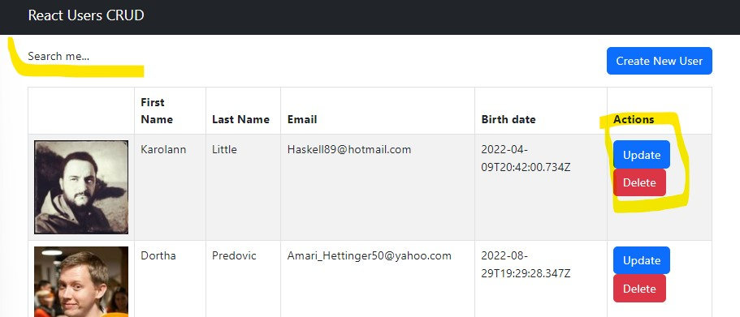

## Crud Users

### Steps

### 1-List of Components

- Container / App
  - Searchbox
  - List
    - List of users
    - Loading animation, data not fount feature
  * Createuser modal

### 2- Create Components State Data

> What I practiced?

- Passing data to components
- Fetch api calls
- Condtional rendering
- Debugging
- Hooks, useState, useEffect
- Loading feature
- Arrow functions
- Rendering list data with map

## Tasks to do

- Update and delete functionality for components

- Search users

## Image

This project was bootstrapped with [Create React App](https://github.com/facebook/create-react-app).
